# Roomba C++ library
---
## Ontwikkel omgeving opzetten

Doxygen is nodig om de documentatie te kunnen genereren en is een dependency van de library.
Stap 1: Download en installeer [doxygen](https://www.doxygen.nl/download.html).
Bij installatie alleen maar "volgende".
Tip! Scroll goed naar beneden en klik onder "A binary distribution for Windows" het doxygen-x.x.x-setup.exe linkje aan.

Om de github repo te kunnen clonen zonder gezeur moeten we een ssh-key maken. Dit doen we in stap 2-5. Bron: [Bitbucket](https://support.atlassian.com/bitbucket-cloud/docs/set-up-an-ssh-key/).

Stap 2: Download en Installeer [Git](https://git-scm.com/download/win)
Kies A.U.B. voor 64-bit tis 2022 tenslotte :)
Pak niet de portable maar Standalone installer link.
Bij installatie alleen maar "volgende".

Stap 3: Open nu git bash vanuit het start menu. 

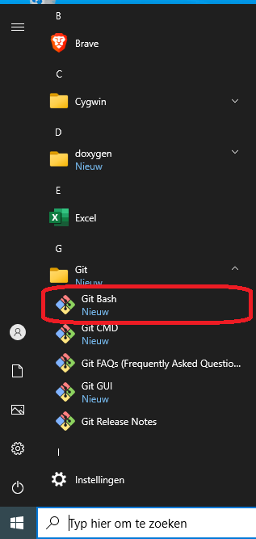

Stap 4: Tik het commando: *ssh-keygen* in en klik alleen maar op ENTER.

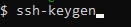

Stap 5: Tik vervolgens het commando: *cat ~/.ssh/id_rsa.pub* in.
Kopieer het resultaat van het commando naar je klembord.

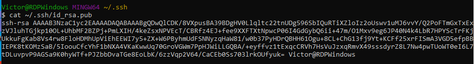

Stap 6: Ga naar GitHub en klik rechtsboven op je profielfoto, selecteer settings. Ga naar SSH and GPG keys en selecteer New SSH Key.

Stap 7: Vul een beschrijvende naam voor je PC in en kopieer de ssh-key uit je klembord in het vak eronder.

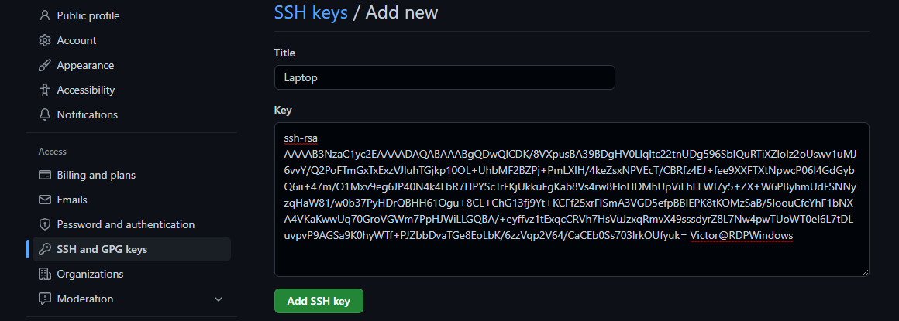

Stap 8: Ga naar de Roomba Repo en klik op clone. Selecteer de optie ssh en kopieer de link.

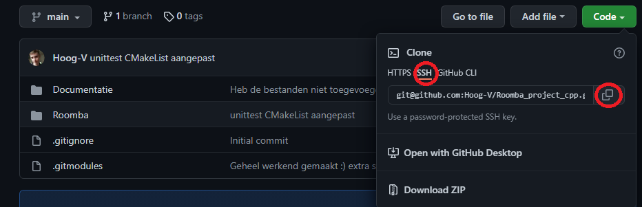

Stap 9: Pak de git bash er weer bij en tik in: *git clone <link> --recursive* . Je krijgt de vraag over de identiteit van de github server typ hier yes in en druk op ENTER. Druk hierna gelijk op ctrl+c. Tenzij je de repo toch wilt clonen.

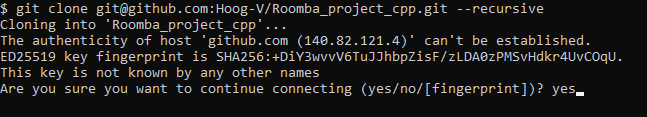

### Visual Studio (windows) (makkelijkst!)

Stap 1: Download en installeer [Visual Studio](https://visualstudio.microsoft.com/).
Kies hier voor de community editie!

Stap 2: Installeer Visual Studio. Kies voor de optie(s):
- "Desktop development with C++"
- "Linux and embedded development with C++"

Vink in het paneel ernaast de volgende extra optie(s) aan:

Onder uitklapmenu Desktop Development with C++:
- "C++ Clang tools for Windows(x.x.x - x86/x86)"
- "Test adapter for Google Test"

Onder uitklapmenu Linux and Embedded development with C++:
- "C++ CMake tools for Linux"
- "Embedded and IoT tools"
- "Legacy Embedded and IoT tools" <= Als hij er staat... Niet altijd het geval!

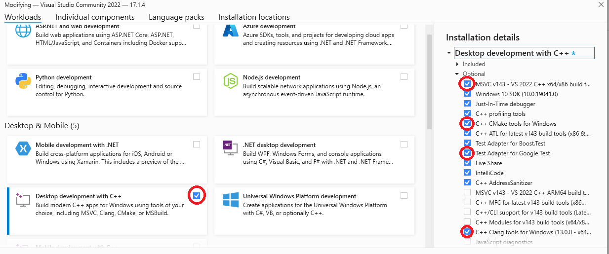

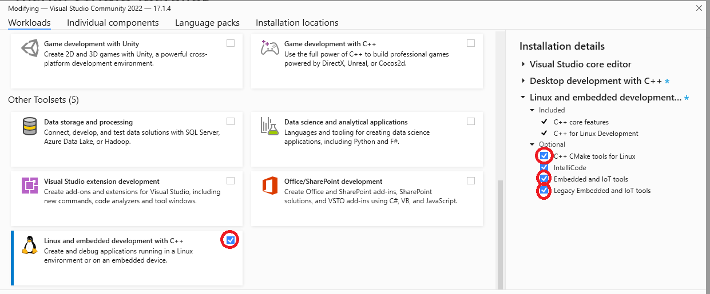

Stap 3: Open Visual Studio en geef voorkeuren aan voor stijlgeving, thema's enz.

Stap 4: Kies de optie "Clone repository".

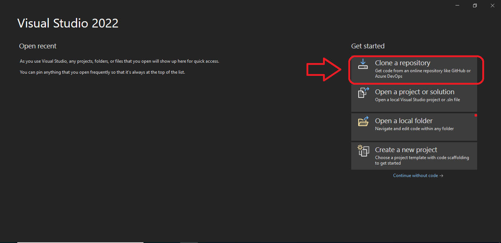

Stap 5: Vul hier de clone link (met optie ssh en moet eindigen op .git) in van deze repo.
Het clonen van de repo duurt even. Dit komt door alle submodules die erin zitten. Dus wees geduldig!

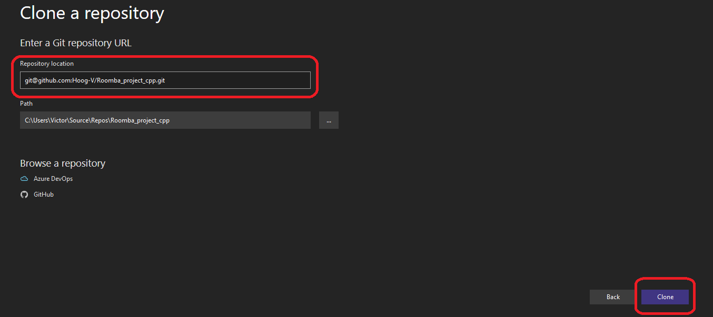

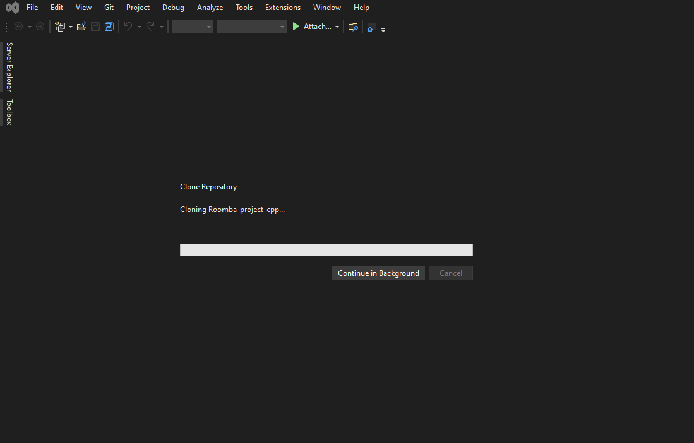

Stap 6: Dubbelklik na het clonen rechts in Solution explorer op de optie "Folder View (C:\....)"

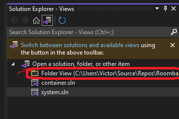

Stap 7: Visual studio komt nu met een vraag over CMake integration. Met de vraag of het aangezet moet worden. Klik op "Enable and set source directory".

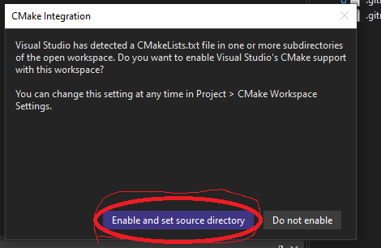

Stap 8: Navigeer dan in het windowtje wat op komt naar map Roomba en selecteer daar het bestand CMakeLists.txt en druk op openen.

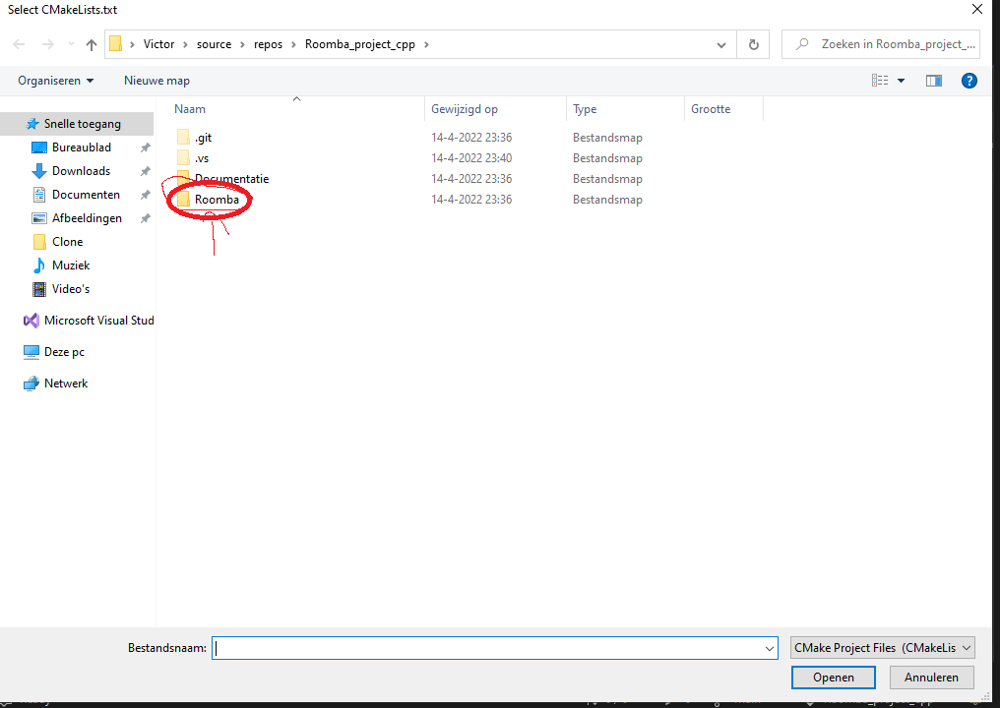

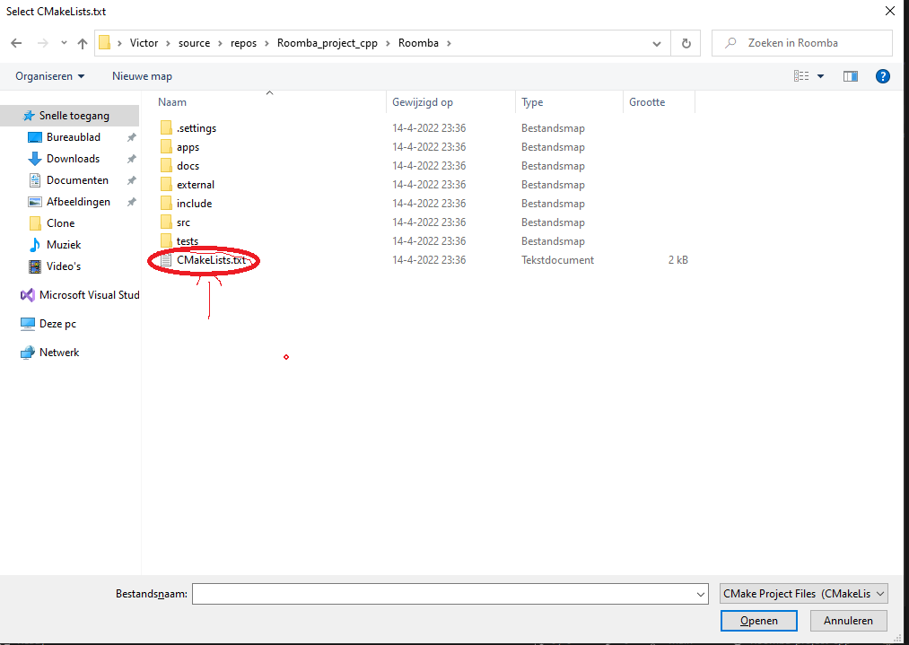

Stap 9: Selecteer in Solution explorer het mapje Roomba. Druk vervolgens op rechter muisknop en selecteer de optie Scope to This.

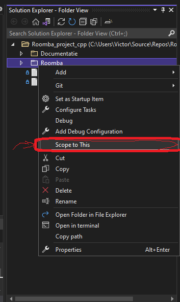

Stap 10: Selecteer in de balk het menu Build en dan Build All (Ctrl+Shift+B).

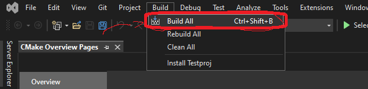

Stap 11: Om een Startup item te kiezen klik op het uitklapicoontje naar select startup item. Kies dan voor app.exe of ExampleTest.exe. 

- App.exe is de hoofdapplicatie de source code staat in het mapje apps.
- ExampleTest is de unit-test de source code staat in het mapje tests/test

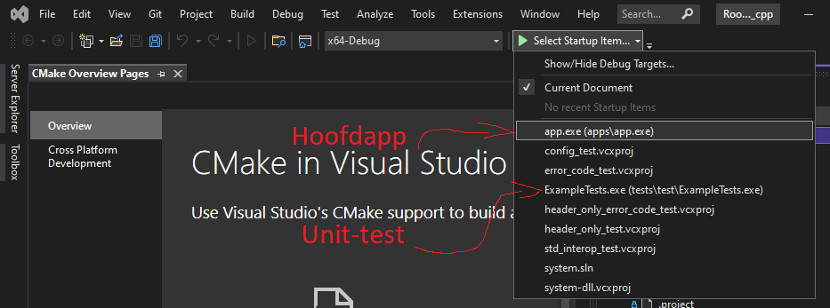

Stap 12: Selecteer in de balk het menu Debug en dan run without debug of debug.

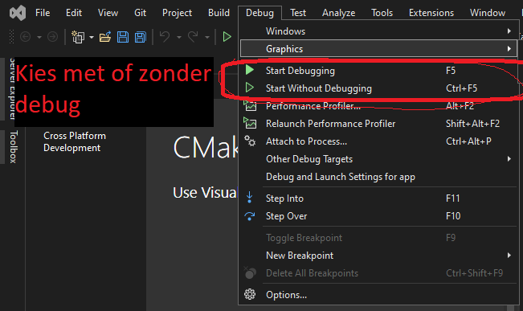

**Gefeliciteerd alles is opgezet!**

### Linux (eclipse)

Stap 1: Ga naar de website van [eclipse](https://www.eclipse.org/downloads/) en klik download x86_64.
Stap 2: Open bestandsbeheer en ga naar de downloadsfolder.

Stap 3: Pak het archief uit door met rechter muisknop erop te klikken en hier uitpakken te kiezen.

Stap 4: Open het mapje eclipse-installer en selecteer met rechtermuisknop eclipse-inst. Kies de optie eigenschappen in het menu. Ga naar rechten en vink aan "Sta toe dat dit bestand wordt uitgevoerd als een programma".

Stap 5: Sluit het eigenschappen paneel en dubbelklik op eclipse-inst.

Stap 6: Een installer verschijnt. Selecteer for eclipse IDE for embedded c/c++ developers.

Stap 7: Druk op install en wacht tot de installatie is voltooid.

Stap 8: Open eclipse druk op launch als die vraagt om een workspace. De standaard optie is goed genoeg.

Stap 9: Open in de menu balk Help->Install New Software. Tik bij het veld *work with* cdt in. Vink dan CDT Main Features en CDT Optional Features aan.

Stap 10: Klik op finish en wacht tot de installatie klaar is.

Stap 11: Selecteer in de menu balk window->perspective->Open perspective->other. Selecteer dan in de window die opkomt git.

Stap 12: Kies voor Clone a Git repository. Vul dan bij url de clone link (met optie ssh en moet eindigen op .git) in van deze repo. 

Stap 13: Klik twee keer op volgende totdat er een menu verschijnt met destination en initial branch. **Vink hier het vinkje clone submodules aan. Klik op finish.**

Stap 14: Aan de linkerkant verschijnt de repo. Klik met rechtermuisknop op de repo en kies de optie import projects.

Stap 15: Vink het project Roomba aan en klik op finish.

Stap 16: Verander het perspectief weer (Zie stap 9) alleen selecteer nu in het laatste menu c/c++ i.p.v. git.

Stap 17: Selecteer in de menubalk Project->Build all (ctrl+b).

